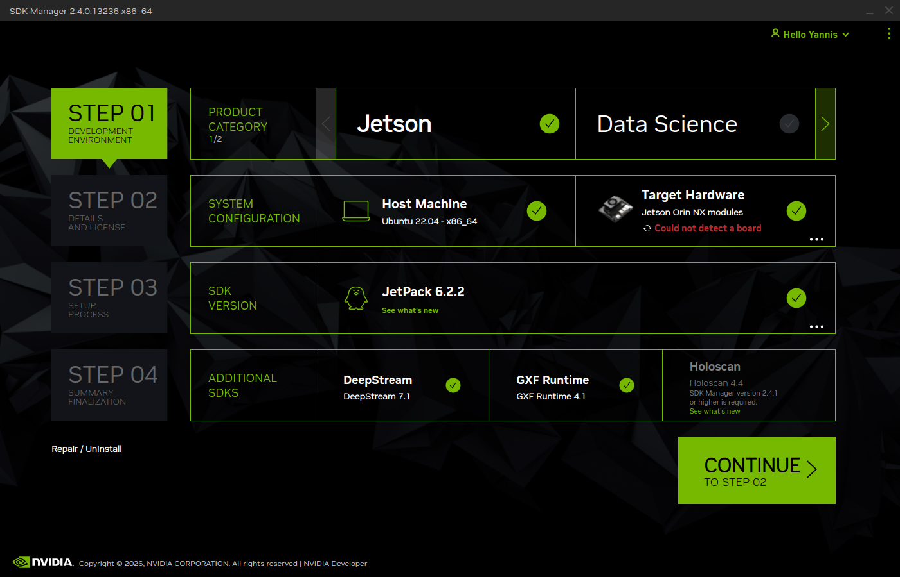
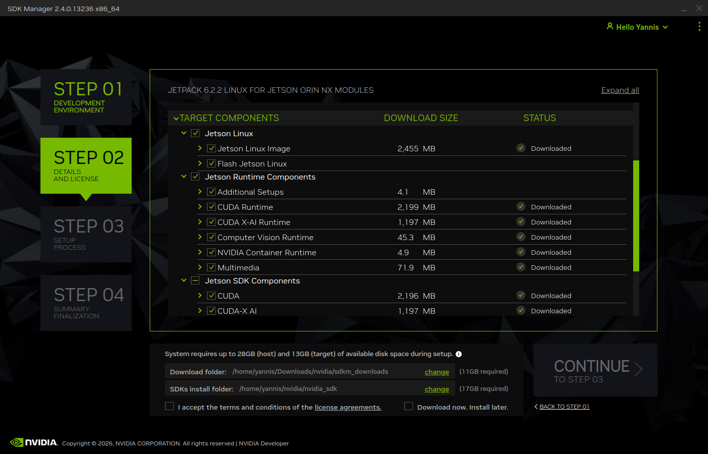
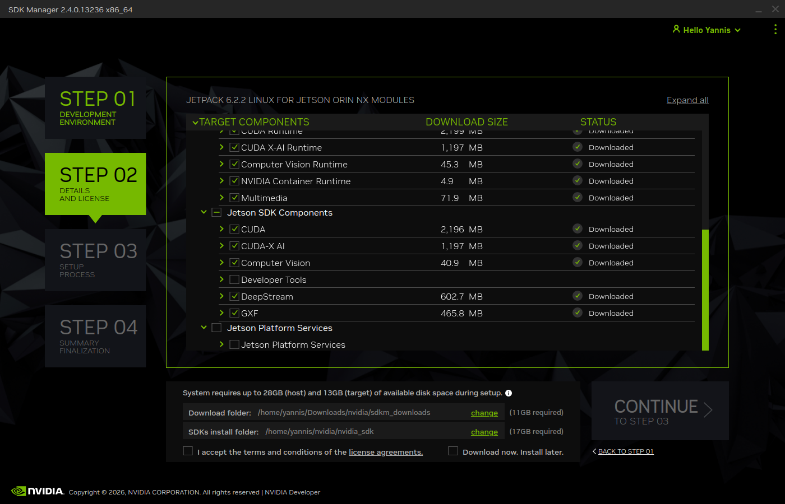

# Nvidia Jetson Orin NX + Framos FSM:GO IMX900C VR-passthrough system

### This project uses one Nvidia Jetson Orin NX 8GB and 2 Framos FSM:GO to create a VR-passthrough/AR system.

| Folders | Purpose |
| :--- | :--- |
| `Installer` | Automatically instantiates the cameras and sets up all components required for the Jetson to run both cameras. |
| `VR_passthrough` | Contains the C++ source files and Makefile to build and run the passthrough system. |

## Whats the purpose of the repo 

This project originated from the Idea to create a fursuit with a 2 cam vr headset custom made to look outside of the world and to to have a funny HUD. Since I didnt find any I had to create a simple solution that is low latency and works out of the box.
  

### Folder Structure
📂 [Jetson-Orin-NX-FRAMOS-BUILDER](./)  
├── 📁 [installer](./installer)   
├── 📁 [vr_passthrough](./vr_passthrough)   
├── 📁 [resources](./resources)  
│   └── 🖼️ [orin_nx_flash_img1.png](./resources/orin_nx_flash_img1.png)
│   └── 🖼️ [orin_nx_flash_img2.png](./resources/orin_nx_flash_img2.png)
│   └── 🖼️ [orin_nx_flash_img3.png](./resources/orin_nx_flash_img3png)  
│   └── 🖼️ [orin_nx_settings.png](./resources/orin_nx_settings)  
└── 📄 [README.md](./README.md)
  

### Hot to contribute

  

### If you have never worked with jetson before or are completely new, then check these things before powering it on
- Dont hotplug in the sensors. always have the board powered off and cut from power.
- The board should have 2x 4-lane CSI2 to utilize full power of the framos sensors.
- You should run 90W Power supply to not run into Overcurrent mode.
  

### Before starting, reflash the Jetson on Ubuntu 22.04LTS with these settings

  

