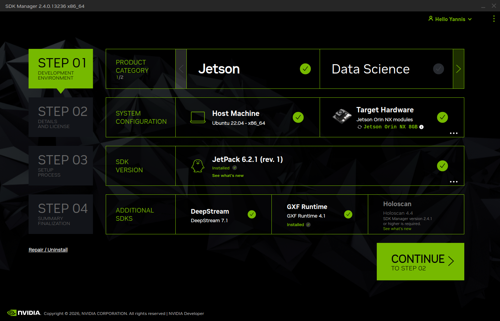
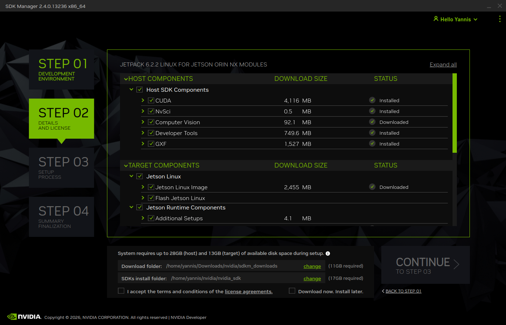

# Jetson Orin NX – FRAMOS Installer

Automated setup for the FRAMOS camera environment and/or VR passthrough on the NVIDIA Jetson Orin NX, powered by Ansible.

## Requirements

- NVIDIA Jetson Orin NX
- FRAMOS FSM:GO IMX 900C

### If you have never worked with jetson before or are completely new, then check these things before powering it on
- Dont hotplug in the sensors. always have the board powered off and cut from power.
- The board should have 2x 4-lane CSI2 to utilize full power of the framos sensors.
- You should run 90W Power supply to not run into Overcurrent mode.
<br></br>

### Before starting, reflash the Jetson on Ubuntu 22.04LTS with these settings




### When Flashed
- cut from power
- plug in cameras to the CSI ports
- plug in power to jetson
- run the sripts in [](./)

## Installation

### 1. Update the system

```bash
sudo apt-get update && apt-get upgrade -y
```

### 2. Install dependencies

```bash
sudo apt install -y curl ansible
```

### 3. Run the installer

Choose which component(s) to install by setting the `target` variable.

**Installs Framos with VR Passthrough system**

```bash
sudo ansible-playbook Install.yml
```

**FRAMOS IMX environment only**

```bash
sudo ansible-playbook Install.yml -e "target=framos"
```

**VR passthrough only**

```bash
sudo ansible-playbook Install.yml -e "target=vr"
```

> No `target` specified? The playbook defaults to `all`.

## Quick reference

| Target | Command | Installs |
|---|---|---|
| `framos` | `ansible-playbook Install.yml -e "target=framos"` | FRAMOS IMX environment only |
| `vr_passthrough` | `ansible-playbook Install.yml -e "target=vr_passthrough"` | VR passthrough only |
| `all` | `ansible-playbook Install.yml -e "target=all"` | Both components |

## One-liner (full install)

```bash
apt-get update && apt-get upgrade -y && apt install -y curl ansible && ansible-playbook Install.yml -e "target=all"
```

## Troubleshooting

| Issue | Fix |
|---|---|
| `ansible: command not found` | Verify `ansible` was installed (step 2) |
| Playbook fails silently | Re-run with verbose logging: `ansible-playbook Install.yml -vvv` |
| Wrong component installed | Double-check the `target` variable in your command |
